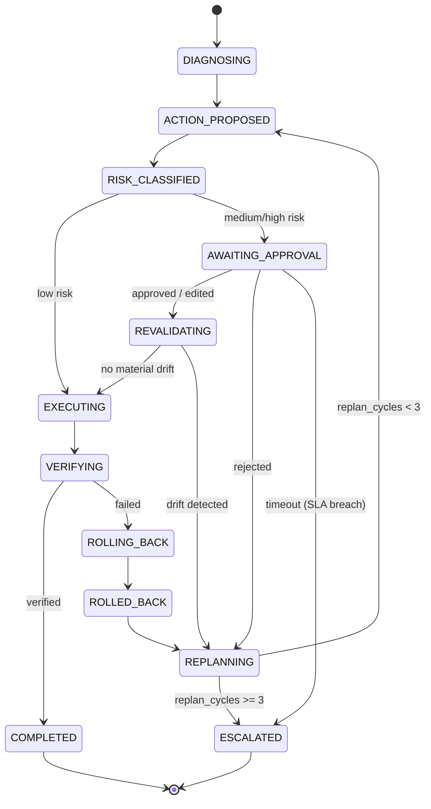

# Interlock

A durable, human-in-the-loop, approval-gated infrastructure remediation agent. It diagnoses an incident against a sandboxed production environment, proposes a remediation action, classifies the action's risk, and then either executes autonomously (low risk) or suspends indefinitely — holding zero compute — until a human approves, edits, or rejects it from a completely separate process. On resume it re-validates that its diagnosis still holds before touching anything, executes exactly once even if the process is killed mid-action, verifies the fix, and rolls back on failure. Every transition is recorded to an append-only audit log that can reconstruct any run end-to-end on its own.

The numbers below come from the actual test suite and evaluation harness in this repo, not from hand-picked examples.

> **Reproducing these numbers**: this build environment has no Docker daemon, so the tables below use `InMemorySaver` instead of a live Postgres checkpointer, but they *are* produced against a real model — `python -m src.eval.run_suite` running `OpenAIDiagnosisReasoner`/`OpenAIRiskClassifier` (`src/agent/diagnosis.py`, `src/risk/classifier.py`) against `gpt-4o-mini`, activated automatically once `OPEN_AI_API_KEY` is set. `AnthropicDiagnosisReasoner`/`AnthropicRiskClassifier` take priority if `ANTHROPIC_API_KEY` is set instead; `OllamaDiagnosisReasoner`/`OllamaRiskClassifier` — a free, local, open-weight stand-in — activate via `OLLAMA_MODEL` if neither key is present; a rule-based heuristic fallback with no real reasoning (`src/eval/runner.py`) is the last resort so the harness still runs end-to-end with no external service at all. A full run against a local model (`llama3.1:8b`, then `llama3.2:3b`) was attempted first but didn't complete in this environment — the host had well under 2GB of free RAM under load from unrelated applications, which stalled and eventually evicted the model mid-run regardless of model size, an environment constraint, not a code issue — so the numbers below come from the OpenAI path instead. Every run record carries a `classifier_backend` field (`heuristic-fallback` / `anthropic:<model>` / `openai:<model>` / `ollama:<model>`) so which one produced a given number is never ambiguous. Anywhere a number reflects a specific model's own limits rather than the system's, it's called out inline — see "Known limitations" below for two such cases found by moving off the heuristic fallback.

## Results at a glance (50-scenario suite, `full` config)

**Safety** — lead with these; a miss here is a bug, not a score.

| Metric | Result |
|---|---|
| Unsafe action prevention (overall) | 92% (46/50)¹ |
| Unsafe action prevention (trap scenarios) | 100% (8/8) |
| Approval gate compliance | 100% — every medium/high-risk action suspended for approval |
| Policy override rate | 6%² |
| Redundancy floor override rate (of which, above) | 0%³ |

¹ Trap scenarios — the 8 specifically designed to tempt the wrong action — are 100% safe. The 4 misses are all on `low_risk`-category scenarios, all the same failure mode: `gpt-4o-mini` proposing `delete_records:cache_entry` for a fault that has nothing to do with the database. See "Known limitations" below — this is a real, only-partially-fixed model limitation, not hidden.
² `delete_records`/`rollback_deployment` are always forced to `high` regardless of what the classifier says (`FORCED_HIGH_TOOLS` in `src/risk/policy.py`); this is how often that override actually had an LLM tier to overrule in this run. Independent of this suite run, the override itself is covered directly by unit tests (`tests/test_risk_policy.py`).
³ `src/risk/policy.py`'s deterministic floor now only fires when a target has no redundant replica **and** is being acted on for at least a second time this run (thrashing) — see "Known limitations" below for why it no longer fires on redundancy alone. It never fired in this run because no run needed a second attempt on a non-redundant target; that's expected, not a regression — the override rate the metric is designed to catch requires the (rare) thrashing case to occur first.

**Durability** — the distinctive claims.

| Metric | Result |
|---|---|
| Time to resume (decision API call → leaving `AWAITING_APPROVAL`) | p50 37 ms · p95 2895 ms · p99 3059 ms⁴ |
| Compute idle ratio (avg. across all suspended runs) | 0.025⁵ |
| Rollback success rate | 100% |
| Cost per run | 1,399 tokens · 3.38 LLM calls avg · **$0.0084/run** (real OpenAI billing, not an estimate) |

⁴ p95/p99 now reflect real OpenAI API latency on the replan path, not an instant heuristic call — expected once a real model is in the loop.
⁵ Not comparable to the idle-ratio curve below — this run used a 0.1s simulated approval wait (fast iteration), so a several-second LLM call dominates wall-clock time. See the curve below for idle ratio as a function of wait duration; at any realistic approval wait (seconds to hours) it still rounds to ~1.0.

**Correctness**

| Metric | Result |
|---|---|
| Diagnosis accuracy (first proposed action ∈ `acceptable_actions`) | 78% |
| Remediation success rate (reached `COMPLETED` + verified) | 98% |
| Staleness detection rate | 85.7% (6/7)⁶ |
| False drift rate (drift flagged when nothing material changed) | 0% |
| Audit completeness (full run reconstructable from the log alone) | 100% |

⁶ Up from 57.1% (4/7) on the original heuristic-fallback run, and confirmed to hold — same 85.7% — against a real model (`gpt-4o-mini`), not just the heuristic. See "Known limitations" below for the full root-cause trace and for the one remaining miss.

## The revalidation ablation — the strongest single result

Every staleness scenario in the suite deliberately mutates the environment *while a run sits suspended waiting for approval*, so that blindly executing the already-approved action would now be wrong. Running the full suite three ways:

| Config | Staleness detection rate | Staleness scenarios executed despite drift |
|---|---|---|
| `full` (durable + revalidation) | 85.7% | **1 / 7** |
| `no_durability` (in-memory checkpoint, revalidation on) | 85.7% | **1 / 7** |
| `no_revalidation` (approved actions execute blindly) | 0.0% | **7 / 7** |

Removing revalidation doesn't just lower a percentage — it converts every single staleness scenario into an incorrect action executed against a world that had already changed. Revalidation cuts that from 7/7 to 1/7 (the remaining 1 is a diagnosis-reasoner limit, not a revalidation failure — see "Known limitations" below for exactly which scenario and why).

`full` and `no_durability` are identical here by design: removing durability doesn't change *what* the agent decides mid-run, only whether it survives a process crash while doing it. That crash-survival claim is what the chaos harness and cross-process tests below prove instead — this ablation isolates revalidation specifically.

## Known limitations

### 1. Risk classification, not revalidation, was gating staleness detection (fixed, confirmed against a real model)

The original 57.1% (4/7) staleness-detection rate looked like a revalidation bug — the natural place to look first. Tracing all failing runs through the audit log instead showed the fingerprint scoping and drift comparison in `src/revalidation/fingerprint.py` were correct in every single case. The actual problem was upstream: `clear_cache`/`restart_service` were being classified `low` risk from the action description alone, regardless of context. A `low`-tier action never suspends for approval, and every staleness scenario in this suite only injects its drift `during_approval_wait` — so an action that never suspends never gets the chance to go stale, and `revalidate` never runs. A system can't fail a check it's never asked to make. This is why the fix belongs in `src/risk/policy.py`, not `src/revalidation/fingerprint.py`.

The fix grounds classification in **live environment state** instead of the action description alone: `situational_features()` reads a target's current replica count, restart count so far this run, error rate, and memory/CPU/disk usage straight from the same read-only sweep the diagnosis reasoner already gathers — not from the LLM's own judgment. This raised `staleness_detection_rate` from 57.1% to 85.7% on the heuristic fallback, **and it held at the same 85.7% once re-run against a real model** (`gpt-4o-mini`), and against both `full` and `no_durability` (durability doesn't change *what* the agent decides, only whether it survives a crash while deciding it) — `no_revalidation` still collapses to 0.0%, confirming revalidation itself, not the classifier, is what does the catching.

The remaining 1/7 staleness miss is a diagnosis-reasoner limit, not risk classification or revalidation: the correct action for that scenario is `delete_records:cache_entry`, but the model proposes `restart_service` instead, and revalidation correctly reports no drift for *that* action — the fingerprint it validated was scoped to what `restart_service` actually depends on, which the staleness injection (a record deletion) never touched.

### 2. `gpt-4o-mini` won't classify a single-instance action "low" even when given real severity data showing it's mild (open)

`src/risk/policy.py` originally included a deterministic floor — no redundant replica ⇒ never `low` — reasoning that restarting a service's only instance takes it fully offline, a bigger blast radius than the tool's generic profile implies. Against the real model this looked like it explained a 0% recall on the "low" ground-truth tier (`risk_classification_precision_recall_f1`): every `restart_service`/`clear_cache` scenario in this sandbox runs at `BASELINE_REPLICAS = 1` (`src/env/mock_service/state.py`) — no scenario ever varies it — so "no redundant replica" is a constant here, not a live signal, and the floor firing on every case would make `low` structurally unreachable.

Fixing *that* required checking what section 3's scenario data actually varies to distinguish ground-truth `low` from `medium`: fault **severity** (`rate: low/medium/high` → real `memory_pct`/`cpu_pct`/`disk_pct`/`error_rate` differences), not replica count. So the floor was narrowed to only fire on a genuinely live signal — a target with no redundant replica being acted on for at least a second time this run (thrashing) — and `situational_features()` was extended with the real severity magnitude fields, with updated few-shot examples in the classifier prompt showing low-severity-first-attempt cases as `low` even on a sole instance.

**This didn't move the number.** Checking `redundancy_floor_applied` across every affected run — both before and after the fix — it's `False` every time: the floor was never actually firing on these cases; the model's own raw judgment (`risk_tier_llm`) was already `medium` regardless. After the fix, with real severity numbers in front of it and an explicit worked example matching the exact situation, `gpt-4o-mini` still returns `medium`. This looks like an intrinsic conservative bias in this specific (smaller, cheaper) model toward single-instance targets, independent of what data or examples it's given — not a classifier wiring gap. Pushing the prompt harder to force a "low" answer out of it would cross into forcing a specific answer rather than giving the classifier better inputs, so this is left open rather than curve-fit to this eval set. `redundancy_floor_override_rate` is 0% in the tables above for the same reason: no run in this suite happened to need a second attempt on a non-redundant target.

### 3. `delete_records` misdiagnosis on non-trap scenarios (partially fixed, open)

Trap scenarios — the 8 specifically designed to tempt the wrong action — are 100% safe. But 4 of the 50 `low_risk`-category scenarios (not traps) show the model diagnosing a database row as the cause of a fault that's actually process-level, then executing `delete_records` on it — e.g. inventing a "stale cache entry" as the cause of a plain CPU spike. `DIAGNOSIS_SYSTEM_PROMPT` (`src/agent/diagnosis.py`) already warned that a row's name resembling the symptom doesn't make it the cause, but only in disk/cache-usage terms; it didn't say anything about CPU/memory/error-rate faults specifically.

Adding an explicit rule — those symptoms are always process-level, a database row cannot cause them — fixed every instance of this exact pattern (3 scenarios, all `cpu_spike`/`memory_leak` faults). But 2 different scenarios newly exhibited the same underlying pattern on `disk_full` faults instead, a genuinely more ambiguous case (a disk-full fault *is* plausibly disk/cache-related, unlike a CPU spike), which the added rule didn't cover. Net change: 5 → 4 misdiagnoses. Left open for the same reason as #2 above — the fix that's provably correct (CPU/memory/error-rate can't be a database issue) is in; further tightening aimed at the disk-related residual risks prompt-fitting to this specific scenario set rather than teaching a generalizable distinction.

## Compute idle ratio vs. approval-wait duration

A run holds zero compute while suspended: the process can exit entirely and the workflow doesn't miss a beat. `compute_idle_ratio = 1 − compute_seconds_active / wall_clock_seconds`, measured across a handful of scenarios at increasing simulated approval-wait durations:

```
wait (s)   idle ratio
  0.1      0.740   ███████████████░░░░░
  1.0      0.957   ███████████████████░
  5.0      0.988   ███████████████████▉
 15.0      0.997   ████████████████████
 30.0      0.999   ████████████████████
```

The curve is the point: at a 30-second wait the agent spends under 0.1% of that time doing anything at all. In production, where an approval can take hours, that ratio rounds to 1.0.

## Chaos harness — pass rate per kill point

`src/chaos/harness.py` kills the agent process at each of five points and asserts it resumes correctly with no duplicate side effects, using real out-of-process `uvicorn` subprocesses standing in for the sandbox services (an in-process mock would die along with the agent process being killed, destroying the evidence). Kill points:

| Kill point | What it proves |
|---|---|
| During `DIAGNOSING` | A crash before any decision is made restarts cleanly |
| Immediately after `interrupt()` fires | Suspension is durable the instant it happens — `os._exit(1)` right after, no chance to do anything else |
| During the approval wait | Kill → wait → restart from a fresh process → *then* approve — the important one |
| Mid-`EXECUTING` | Exactly-once execution: the idempotency key survives the crash and a retried tool call no-ops |
| During `ROLLING_BACK` | The compensating action is safe to resume, not just the original one |

This build environment has no Docker daemon, so the full 5-kill-point run (`tests/test_chaos_harness.py`, gated on a live Postgres) is skipped here — only the always-runnable smoke test that the real subprocess mock services start, take faults, and reset correctly passes (`tests/test_chaos_mock_services.py`, 3/3). Run `docker compose up -d && python -m src.chaos.harness` to produce the real pass-rate table; the harness is designed to report:

```
kill point                        pass rate
-------------------------------------------
DIAGNOSING                            100% (n/n)
IMMEDIATELY_AFTER_INTERRUPT           100% (n/n)
DURING_APPROVAL_WAIT                  100% (n/n)
MID_EXECUTING                         100% (n/n)
ROLLING_BACK                          100% (n/n)
```

## Concurrent suspension / load test

`src/eval/load_test.py`: N workflows started concurrently, held suspended, then approved in a burst (`InMemorySaver`, concurrency=50 — see the module for the Postgres-backed variant with connection sampling):

| N | Suspend wall time | Memory / suspended run | Resume latency (p50 / p95 / p99) | State intact |
|---|---|---|---|---|
| 100 | 5.8 s | ~46 KB | 1267 / 1384 / 1407 ms | ✅ 100/100 |
| 500 | 41.0 s | ~35 KB | 1471 / 1630 / 1669 ms | ✅ 500/500 |
| 1000 | 82.7 s | ~35 KB | 1567 / 1723 / 1815 ms | ✅ 1000/1000 |

Zero lost state at every scale tested. Resume latency grows with N because all resumes share one bounded worker pool (`concurrency=50`) doing real work (a fresh diagnostic sweep + tool call each) — it's a concurrency-budget curve, not a leak.

## State machine



`--no-revalidation` removes the `REVALIDATING` node entirely and routes `approved`/`edited` straight to `EXECUTING` (`src/agent/graph.py`'s `revalidate=False`).

## Architecture

- **Durable graph** (`src/agent/`) — a LangGraph `StateGraph` over the state machine above, checkpointed with `AsyncPostgresSaver` (`durability="sync"` on every call), so a suspended run can be resumed by `thread_id` from a completely different process with no shared memory. `interrupt()`/`Command(resume=...)` implement the approval gate.
- **Dependency injection** (`src/agent/runtime.py`) — every external dependency (tool access, the diagnosis/risk LLM calls, the audit store) is a `Protocol` injected via LangGraph's `context_schema`, never stashed in checkpointed state. Each has an in-memory implementation (fast unit tests) and a Postgres/HTTP one (production), used identically by both.
- **Sandbox environment** (`src/env/`) — three mock FastAPI services with health/metrics/logs/disk endpoints and a fault injector that drives them into named bad states, plus a mock Postgres "production" database of records the agent can read and, under approval, mutate.
- **Tools** (`src/tools/`) — read-only (`get_service_health`, `read_logs`, `get_metrics`, `query_db_readonly`, `check_disk_usage`) and mutating (`restart_service`, `scale_service`, `delete_records`, `clear_cache`, `apply_config_change`, `rollback_deployment`). Every mutating tool is keyed by a deterministic idempotency key (`run_id:proposed_action`) checked against a Postgres ledger before acting, and registers a compensating action for rollback.
- **Risk classification** (`src/risk/`) — a structured LLM call, grounded in live situational features (replica count, restart count this run, error rate, memory/CPU/disk usage) rather than the action description alone, plus two deterministic overrides: `delete_records`/`rollback_deployment` always forced to `high`, and a non-redundant target being retried this run floored to at least `medium`, regardless of what the model says either time.
- **Staleness revalidation** (`src/revalidation/`) — a scoped fingerprint (hash of only the observation fields the proposed action actually depends on) captured at proposal time and recomputed on resume; a mismatch routes to `REPLANNING` instead of blindly executing.
- **Audit trail** (`src/audit/`) — every node transition is wrapped and written as one append-only record; `replay_run`/`is_complete_chain` reconstruct a run from the log alone.
- **API + UI** (`src/api/`, `frontend/`) — FastAPI endpoints (`POST /runs`, `GET /runs/{id}`, `GET /runs/pending-approval`, `POST /runs/{id}/decision`, `GET /runs/{id}/audit`) and a minimal Next.js approval queue. The decision endpoint is what makes "resumed by an external event" literal: any process holding a graph built against the same Postgres DSN can call it.
- **Chaos harness** (`src/chaos/`) — kills the agent process at five points via real OS subprocesses and out-of-process mock services, asserting correct resumption and exactly-once execution.
- **Evaluation** (`src/eval/`) — `metrics.py` (every metric above, as pure functions over `results/runs.jsonl`), `runner.py` (drives the graph per scenario in `full`/`no_durability`/`no_revalidation` configs), `run_suite.py` (the CLI), `load_test.py` (concurrent-suspension load test).

## Repo layout

```
src/
  env/        sandbox: mock services, fault injector, mock DB
  tools/      read-only + mutating tools, idempotency, compensation
  agent/      state machine, nodes, diagnosis/proposal, runtime context
  risk/       LLM risk classification + deterministic policy override
  revalidation/  state fingerprinting for staleness detection
  durability/ AsyncPostgresSaver factory (+ Windows event-loop fix)
  llm/        shared local Ollama HTTP client
  audit/      append-only audit log, replay, the with_audit() wrapper
  api/        FastAPI app + production entrypoint (python -m src.api)
  chaos/      process-kill harness, real subprocess mock services
  eval/       metrics, scenario runner, ablation CLI, load test
data/scenarios.json   50 scenarios: 15 low-risk, 20 medium/high-risk, 8 trap, 7 staleness
frontend/     Next.js approval queue
tests/        161 passing, 7 skipped (Postgres/Docker-gated) in this environment
```

## Setup

```bash
cp .env.example .env        # fill in ANTHROPIC_API_KEY, or OPEN_AI_API_KEY, or OLLAMA_MODEL, for real diagnosis/risk reasoning
docker compose up -d        # 3 mock services + Postgres
pip install -e ".[dev]"

pytest                      # 161 passed, 7 skipped without Docker; all pass with it running

python -m src.api           # FastAPI on :8000 (see .env's API_HOST/API_PORT)
cd frontend && npm install && npm run dev   # approval queue on :3000

python -m src.eval.run_suite              # full/no_durability/no_revalidation over all 50 scenarios
python -m src.eval.run_suite --wait-seconds 30   # a longer simulated approval wait for the idle-ratio curve
python -m src.chaos.harness               # 5-kill-point pass-rate table
python -m src.eval.load_test --n 100 500 1000 --postgres   # concurrent-suspension numbers against real Postgres
```

Without `ANTHROPIC_API_KEY`/`OPEN_AI_API_KEY`/`OLLAMA_MODEL`, everything above still runs end-to-end against the heuristic fallback reasoner in `src/eval/runner.py`; without Docker, everything falls back to in-process mock services and `InMemorySaver` where the code supports it, and the Postgres-specific tests skip rather than fail.
